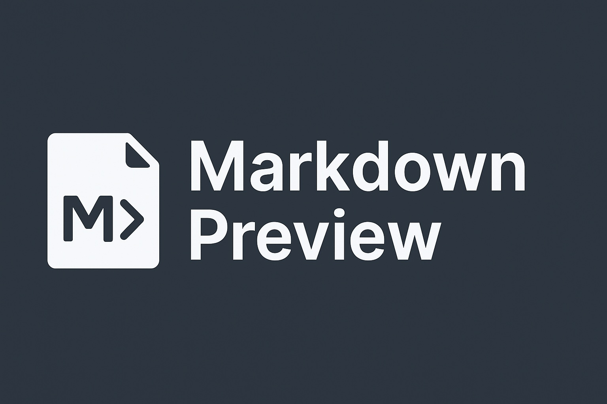

# Github flavored markdown with mermaid diagrams



## Live Version

Check out the live version of the Markdown Live Previewer here: [http://kejkej.pl/markdown](http://kejkej.pl/markdown)

## About The Project

This application provides a real-time preview of Markdown content. As you type Markdown in one panel, you'll see the rendered HTML output in an adjacent panel. It's designed to be a simple and efficient tool for writing and previewing Markdown documents, with support for standard Markdown syntax, code syntax highlighting, and Mermaid diagrams.

The project is open source, and you're welcome to explore the code, though it's primarily a personal project.

## How It Works

The Markdown Live Previewer is built using:

*   **Frontend Framework:** [React](https://reactjs.org/) with [TypeScript](https://www.typescriptlang.org/)
*   **Build Tool:** [Vite](https://vitejs.dev/)
*   **Styling:** [Tailwind CSS](https://tailwindcss.com/)
*   **Markdown Parsing:** The [Marked.js](https://marked.js.org/) library is used for converting Markdown text into HTML.
*   **Syntax Highlighting:** Code blocks are highlighted using [Highlight.js](https://highlightjs.org/), integrated via the `marked-highlight` extension
*   **Diagram Rendering:** [Mermaid.js](https://mermaid.js.org/) is used to render diagrams and flowcharts from text-based definitions within Markdown (e.g., `\`\`\`mermaid ... \`\`\`).

## Getting Started (Development)

To run this project locally:

1.  Clone the repository:
    ```bash
    git clone <repository-url>
    cd markdown-live-previewer
    ```
2.  Install dependencies (this project uses Bun):
    ```bash
    bun install
    ```
3.  Start the development server:
    ```bash
    bun dev
    ```
    This will typically open the application in your default web browser.

## Building for Production

To create an optimized production build:

```bash
bun run build
```
The build artifacts will be placed in the `dist/` directory.